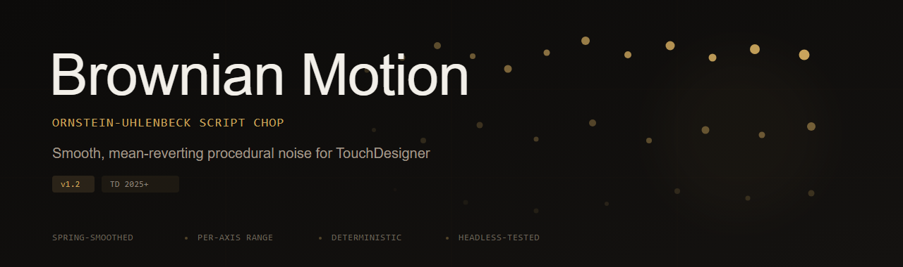

<p align="center">
  
</p>


[](https://github.com/REMvisual/claude-handoff/releases/latest)


Ornstein-Uhlenbeck brownian motion for TouchDesigner. A Script CHOP that generates smooth, mean-reverting procedural noise — perfect for organic camera drift, floating objects, generative motion, and anything that needs to feel alive.

## What It Does

Unlike random noise, Ornstein-Uhlenbeck motion always pulls back toward center — so you get natural, bounded wandering instead of unbounded drift. A critically-damped spring filter smooths the output for silky motion at any speed.

- **Mean-reverting** — stays within your defined range, no runaway values
- **Spring-smoothed** — critically-damped filtering removes jitter
- **Per-axis control** — enable/disable X, Y, Z independently
- **Per-axis range** — optionally set different min/max bounds for each axis
- **Deterministic** — set a seed for repeatable motion
- **Headless-tested** — 20 automated tests validate the math at extreme parameters

## Install

**Requires TouchDesigner 2025+** (uses `CookLevel.ALWAYS` and 2025.x absTime behavior).

1. **[Download the .tox](https://github.com/REMvisual/touchdesigner-brownian-motion/releases/latest)** from Releases
2. Drag into your TouchDesigner project
3. Wire the CHOP output to whatever needs motion

Outputs three channels: `tx`, `ty`, `tz`.

## Parameters

### Motion

**Range Min / Range Max** `[-1, 1]`
Output bounds. The normalized [-1, 1] motion gets mapped to this range. Default [-1, 1] means output matches the raw sim. Set to [0, 100] and your channels wander between 0 and 100.

**Speed** `1.0`
How fast time passes for the simulation. Speed=1 is real-time. Speed=5 means the OU process evolves 5x faster — more ground covered per frame. Transitions are smoothed so dragging the slider doesn't cause jumps.

**Amplitude** `1.0`
Output multiplier. 0 = silence, 1 = full range. Useful for fading motion in and out.

**Reversion** `2.0`
How strongly the motion pulls back toward the center point (theta in the OU equation). High values = tight orbit around center, snaps back quickly. Low values = lazy wandering, barely cares about center. Zero = pure Brownian motion, no pull at all.

**Roughness** `0.5`
Controls the smoothing filter on the output. 0 = very smooth, flowing motion (spring with ~2s settling). 0.5 = moderate. 1 = raw unfiltered OU, no spring at all. Doesn't affect speed, just the texture of the motion.

### Range

**Per-Axis Range** `Off`
Toggle to set different min/max per axis. When off, all axes share the same Range Min/Max. When on, each axis gets its own bounds — useful when X needs [-180, 180] degrees but Y only needs [-10, 10].

**Range Min/Max X, Y, Z** `[-1, 1]`
Per-axis output bounds. Only visible when Per-Axis Range is on.

### Axes

**Affect X / Y / Z** `All on`
Per-axis enable toggles. Disabled axes output zero.

### Advanced

**Center X / Y / Z** `0`
The point each axis drifts toward, in normalized [-1, 1] space. Default 0 = center of range. Set Center X to 0.5 and `tx` will hang out in the upper half of your range.

**Seed** `0`
Random seed for reproducibility. 0 = unseeded (different every time). Any other value = deterministic — same seed always produces the same motion after Reset.

**Independent** `On`
When ON (default), each axis gets its own random noise — `tx`, `ty`, `tz` move independently in 3D. When OFF, all three axes share the same noise value each step, so they move together in lockstep (motion along the diagonal). Useful if you want correlated movement across channels.

**Reset** `Pulse`
Snap all channels back to their center positions and re-seed the RNG. Fresh start.

## The Math

Uses the **Ornstein-Uhlenbeck** stochastic process — a mean-reverting random walk:

```
dx = theta * (mu - x) * dt  +  sigma * sqrt(dt) * N(0,1)
```

Where `theta` is reversion strength, `mu` is center bias, and `sigma = 0.55 * sqrt(2*theta)` is tuned so the stationary distribution fills ~80% of the [-1,1] range.

A **critically-damped second-order spring** filter smooths the raw OU signal. The spring's natural frequency scales with speed so smoothing keeps pace with faster motion. Sub-stepping (max 1/120s per step) ensures numerical stability at any speed.

## License

[MIT](LICENSE) — use it however you want.
